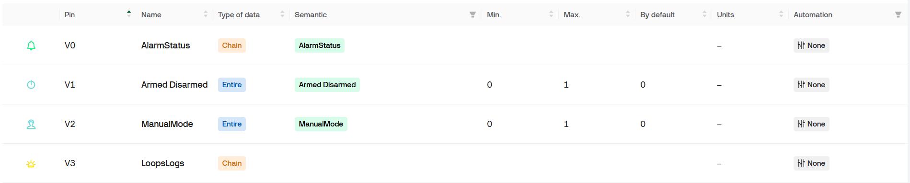
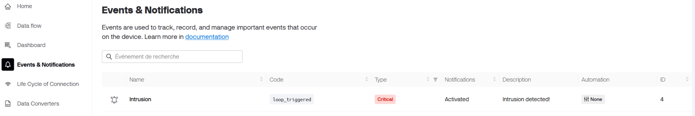
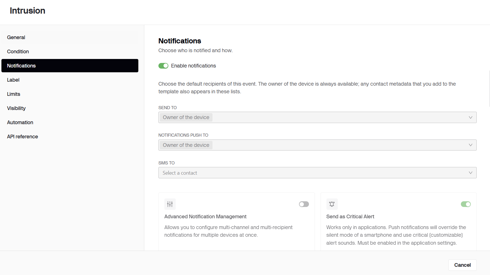
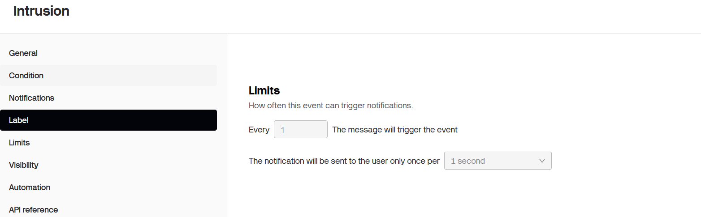
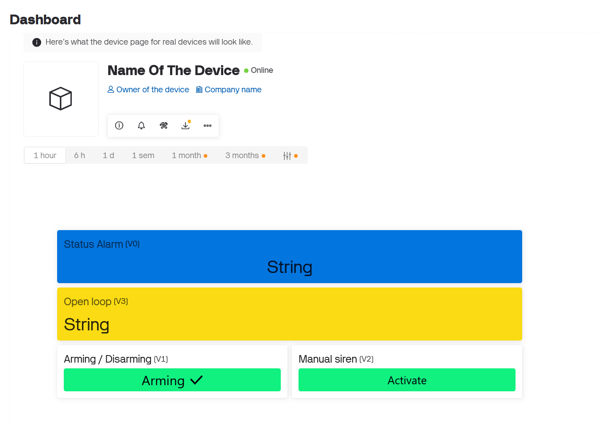
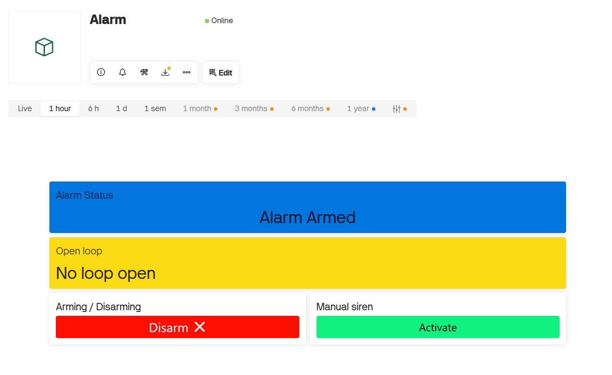

# ESP32 Alarm System

**[English](README.md) | [Français](README.fr.md)**

Un système d'alarme domestique intelligent basé sur l'ESP32, utilisable en **mode autonome** ou **connecté à internet** avec contrôle distant complet via la plateforme d'IoT [Blynk](https://blynk.io/).

Le dépôt contient un projet PlatformIO complet à sa racine.

---

## Table des matières

- [Fonctionnalités](#fonctionnalités)
- [Structure du projet](#structure-du-projet)
- [Démarrage](#démarrage)
- [Configuration](#configuration)
- [Blynk / Contrôle distant](#blynk--contrôle-distant)
- [Exemple d'utilisation](#exemple-dutilisation)
- [Schémas](#schémas)
- [Lexique](#lexique)
- [Contribuer](#contribuer)
---

## Fonctionnalités

### Exclusion intelligente des boucles

La plupart des alarmes basiques fonctionnent toutes de la même façon : si une porte/fenêtre est ouverte une fois, l'alarme sonne puis se désarme effectivement, car la ré-armer déclencherait à nouveau immédiatement l'alarme à cause de cette même ouverture.

Ce système fonctionne différemment. Chaque porte, fenêtre ou détecteur de mouvement est traité comme une **boucle indépendante** :

- Lorsqu'une boucle est déclenchée, la sirène sonne **et cette boucle spécifique est temporairement exclue** de la détection.
- L'alarme se ré-arme immédiatement, en ignorant uniquement la boucle qui a été déclenchée — toutes les autres boucles restent actives.
- Si une boucle exclue est refermée physiquement (ex : une porte est refermée), elle est **automatiquement réintégrée** dans l'ensemble des boucles actives.
- Si toutes les boucles finissent par être exclues, l'alarme ne peut plus sonner (aucune boucle de détection disponible) et entre dans un **état d'attente**. Dès qu'une boucle est refermée, le système se réarme et reprend la surveillance.

Cela garantit que l'alarme reste opérationnelle et continue de protéger le reste de la propriété, même si un point d'entrée a déjà été compromis.

### Surveillance et contrôle distant (Blynk)

L'alarme peut optionnellement se connecter au Wi-Fi et communiquer son statut via Blynk :

- Statut actuel : armée / désarmée / en cours d'armement / déclenchée
- Quelle boucle a déclenché l'alarme
- Armement / désarmement à distance
- Activation manuelle de la sirène à distance
- Notifications push et email en cas d'intrusion

> Blynk est utilisé par défaut, mais la couche de communication est découplée (voir `src/communication`), donc libre à vous d'implémenter un autre protocole (par exemple du MQTT pur).

---

## Structure du projet

```
.
├── include/
│   └── constants.h          # Mapping des pins, délais, et autres constantes système
├── src/
│   ├── main.cpp              # Point d'entrée du programme
│   ├── AlarmManager.cpp       # Cœur de la logique de l'alarme (armement, suivi des boucles, exclusion)
│   ├── devices/               # Abstractions du matériel physique (boucles, sirènes, etc.)
│   ├── communication/         # Couche de communication internet / Blynk
│   └── Indicator/             # Gestion des indicateurs LED
├── credentials_example.ini    # Modèle pour vos identifiants Wi-Fi et Blynk
└── platformio.ini             # Configuration du projet PlatformIO
```

---

## Démarrage

1. Installez [VS Code](https://code.visualstudio.com/) et l'extension [PlatformIO IDE](https://platformio.org/install/ide?install=vscode).
2. Clonez ce dépôt.
3. Ouvrez le dossier racine dans VS Code.
4. PlatformIO téléchargera automatiquement les toolchains et dépendances pour l'ESP32.

---

## Configuration

### Constantes système

Le comportement du système est défini dans [`include/constants.h`](include/constants.h) : mapping des pins, délais, durée de la sirène, etc. Ajustez ces valeurs selon votre câblage et la réglementation locale.

| Constante | Description |
|---|---|
| `PIN_LOOP_1..4` | Pins GPIO pour chaque boucle de détection (porte/fenêtre/détecteur de mouvement) |
| `PIN_LED_LOOP_1..4` | LEDs de statut optionnelles pour chaque boucle |
| `PIN_LED_ALARM_STATUS` | LED globale de statut de l'alarme |
| `PIN_RELAY_SIREN` | Pin du relais de la sirène |
| `PIN_BTN_ARM` | Bouton optionnel d'armement/désarmement |
| `ARMING_DELAY` | Délai avant que l'alarme devienne active après armement |
| `ENTRY_DELAY` | Délai de grâce sur la boucle d'entrée principale, pour avoir le temps de désarmer avant que la sirène sonne |
| `DEFAULT_SIREN_DURATION_MS` | Durée pendant laquelle la sirène reste active une fois déclenchée |
| `POSIX_RULE` | Chaîne de fuseau horaire au format POSIX, utilisée par ezTime pour horodater correctement les notifications (ex : `CET-1CEST,M3.5.0,M10.5.0/3` pour la France) — voir [posix.timezoneapi.io](https://posix.timezoneapi.io/) pour trouver la vôtre |

### Identifiants Wi-Fi & Blynk

Les identifiants sont exclus du contrôle de version. Pour les configurer :

1. Copiez `credentials_example.ini` en `credentials.ini` à la racine du projet.
2. Renseignez vos propres valeurs :

```ini
[env]
build_flags =
    # Vos identifiants Blynk
    -DBLYNK_TEMPLATE_ID="EXAMPLE"
    -DBLYNK_TEMPLATE_NAME="ExampleName"
    -DBLYNK_AUTH_TOKEN="EXAMPLE-TOKEN"

    # Votre réseau Wi-Fi
    -DWIFI_SSID="Example-SSID"
    -DWIFI_PASS="Example-PASS"
```

---

## Blynk / Contrôle distant

### Datastreams

Le template Blynk expose les pins virtuels suivants :

| Pin | Nom | Type | Description |
|---|---|---|---|
| `V0` | AlarmStatus | String | Statut de l'alarme, lisible par un humain |
| `V1` | Armed / Disarmed | Entier (0/1) | État d'armement actuel, utilisé aussi pour armer/désarmer à distance |
| `V2` | ManualMode | Entier (0/1) | Déclenche manuellement la sirène |
| `V3` | LoopsLogs | String | Nom de la dernière boucle déclenchée |



### Notifications

Un événement **Intrusion** (`loop_triggered`) est configuré sur le template pour vous alerter dès qu'une boucle est déclenchée :



- Envoyée sous forme de notification push (nécessite l'app mobile Blynk) et par email.
- Peut être envoyée en tant qu'**alerte critique**, outrepassant le mode silencieux du téléphone.



- Un intervalle minimum entre deux notifications peut être défini, pour éviter d'être spammé si une boucle est déclenchée de façon répétée.



### Dashboard

Un dashboard simple peut être construit à partir de ces datastreams, affichant :

- Le statut de l'alarme (armée / désarmée / déclenchée)
- Quelle boucle est actuellement ouverte, le cas échéant
- Un interrupteur d'armement/désarmement
- Un bouton de déclenchement manuel de la sirène



Voici à quoi ça ressemble une fois branché à un vrai appareil, avec l'alarme armée et aucune boucle ouverte :



Pour recevoir les notifications push sur votre téléphone, installez l'application mobile Blynk et configurez-y le même dashboard.

---

## Exemple d'utilisation

### Alarme autonome (sans internet)

Si vous ne souhaitez pas utiliser le `main.cpp` fourni tel quel, vous pouvez construire votre propre configuration directement avec les composants de la librairie :

```cpp
#include <devices/DetectionLoop.h>
#include <devices/Siren/RelaySiren.h>
#include <AlarmManager.h>

// Boucles de détection
DetectionLoop loop1(13, "Main Door", 10000); // Vous pouvez ajouter un délai d'entrée de 10s pour désarmer avant qu'elle sonne (pas obligatoire)
DetectionLoop loop2(12, "Window 1");

// Sirène
RelaySiren siren(18, false); // mettre à true si le relais est actif à l'état bas (LOW)

// Regrouper toutes les boucles ensemble
std::vector<DetectionLoop*> loops = {&loop1, &loop2};

// Gestionnaire d'alarme
AlarmManager alarmManager(siren, loops);

// État du bouton d'armement/désarmement
bool lastButtonState = HIGH;

void setup() {
    Serial.begin(115200);
    alarmManager.init();
    alarmManager.setArmingDelay(20000);
}

void loop() {
    alarmManager.update();

    // Armer / désarmer sur pression du bouton (à câbler vous-même)
    bool reading = digitalRead(PIN_BTN_ARM);
    if (reading == LOW && lastButtonState == HIGH) {
        if (alarmManager.getCurrentState() == AlarmManager::DISARMED) {
            alarmManager.armAlarm();
        } else {
            alarmManager.disarmAlarm();
        }
    }
    lastButtonState = reading;
}
```

### Alarme autonome avec indicateurs LED

Vous pouvez ajouter un retour visuel local via LED — une LED par boucle, plus une LED globale de statut — sans aucune connexion internet, en utilisant les classes de `src/Indicator`. Cela permet de visualiser en un coup d'œil si l'alarme est armée, désarmée, ou en train de sonner suite à une intrusion, et de voir quelle boucle précise a été déclenchée :

```cpp
#include <devices/DetectionLoop.h>
#include <devices/Siren/RelaySiren.h>
#include <AlarmManager.h>
#include <LoopIndicator.h>
#include <AlarmIndicator.h>
#include <IndicatorManager.h>

// Boucles de détection
DetectionLoop loop1(13, "Main Door", 10000);
DetectionLoop loop2(12, "Window 1");

// Sirène
RelaySiren siren(18, false);

// Regrouper toutes les boucles ensemble
std::vector<DetectionLoop*> loops = {&loop1, &loop2};

// Gestionnaire d'alarme
AlarmManager alarmManager(siren, loops);

// Une LED par boucle, allumée quand cette boucle est déclenchée
LoopIndicator loopIndicator1(25, alarmManager);
LoopIndicator loopIndicator2(33, alarmManager);

// Une LED reflétant l'état global de l'alarme (armée / désarmée / déclenchée)
AlarmIndicator alarmIndicator(26);

// Gestionnaire qui pilote tous les indicateurs ci-dessus
IndicatorManager indicatorManager(alarmManager);

void setup() {
    Serial.begin(115200);
    alarmManager.init();
    alarmManager.setArmingDelay(20000);

    // Enregistrer chaque indicateur auprès du gestionnaire
    indicatorManager.addLoopIndicator(loopIndicator1, loop1);
    indicatorManager.addLoopIndicator(loopIndicator2, loop2);
    indicatorManager.setAlarmIndicator(alarmIndicator);
}

void loop() {
    alarmManager.update();
    indicatorManager.update(); // Maintient chaque LED synchronisée avec l'état actuel
}
```

`IndicatorManager` centralise les appels de mise à jour : il suffit d'appeler `indicatorManager.update()` dans la boucle principale — il se charge de rafraîchir chaque `LoopIndicator` enregistrée et l'`AlarmIndicator` en fonction de l'état actuel d'`AlarmManager`.

### Alarme connectée (Wi-Fi + Blynk)

La configuration connectée s'appuie sur les mêmes classes `AlarmManager` / `DetectionLoop` / `RelaySiren` que ci-dessus, et ajoute quelques éléments supplémentaires :

- **`WiFiManager`** — un singleton qui connecte l'appareil à votre réseau Wi-Fi et maintient la connexion active.
- **`BlynkService`** — l'implémentation spécifique à Blynk de la couche de communication : elle sait lire/écrire les pins virtuels Blynk et envoyer des notifications push/email. C'est l'élément à remplacer si vous souhaitez utiliser un autre protocole (par exemple MQTT).
- **`CommunicationManager`** — la couche de liaison entre `AlarmManager` et un service de communication (ici, `BlynkService`). Il est configuré avec un mapping des clés et valeurs des pins virtuels (statut, armer/désarmer, mode manuel, boucle déclenchée, code de notification) et maintient le dashboard distant synchronisé à chaque changement d'état.
- **[ezTime](https://github.com/ropg/ezTime)** — garde les horodatages des notifications correctement ajustés à votre fuseau horaire et à l'heure d'été/hiver, configuré via une chaîne TZ au format POSIX (par exemple `CET-1CEST,M3.5.0,M10.5.0/3` pour la France).

Comme la configuration connectée assemble plusieurs éléments supplémentaires, la version complète et fonctionnelle se trouve directement dans [`src/main.cpp`](src/main.cpp) plutôt que d'être dupliquée ici — ainsi ce README ne se désynchronise jamais du code réel.

Si vous mettez en place votre propre version connectée, partez de `main.cpp`, renseignez `credentials.ini` comme décrit dans la section [Configuration](#configuration), et utilisez la [section Blynk](#blynk--contrôle-distant) ci-dessus pour recréer le template et le dashboard.

---

## Schémas
Les schémas électriques du montage seront disponibles prochainement.

---

## Lexique

- **Boucle** : le circuit de câblage ou la ligne de communication reliant un élément de détection (contact de porte/fenêtre, détecteur de mouvement, etc.) au contrôleur central (ici, l'ESP32). Chaque porte, fenêtre ou détecteur de mouvement est traité comme une boucle indépendante.

---

## Contribuer

Les issues et pull requests sont les bienvenues. Ce projet est encore en cours de développement, donc tout retour sur la logique de l'alarme, les abstractions matérielles, ou la documentation est apprécié.

---

## Licence

Ce projet est distribué sous licence **GNU General Public License v3.0 (GPLv3)** — voir le fichier [LICENSE](LICENSE) pour le détail.

En résumé : vous êtes libre d'utiliser, modifier et redistribuer ce projet, y compris à des fins commerciales, tant que toute œuvre dérivée distribuée reste open-source sous la même licence (GPLv3), avec le code source rendu disponible.
